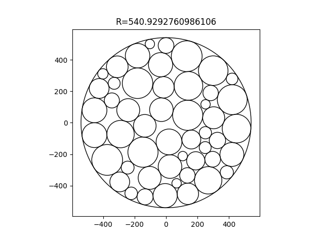
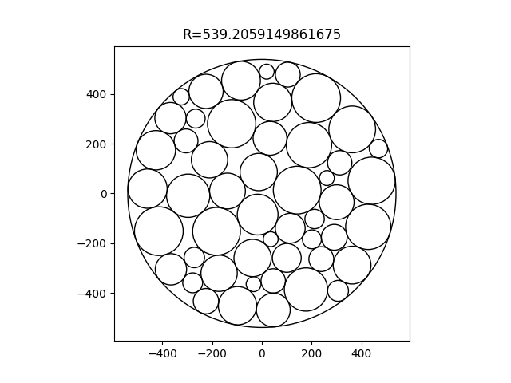

# Circles packing problem solver

There are set of circles that need to be packed in circle, placed in $(0, 0)$, in such way, that any of cirlces overlap and are inside main circle. This solution find one of **local** extremes. 

## Condition
$$
\begin{cases}
  (x_i-x_j)^2 + (y_i-y_j)^2 \ge (r_1+r_2)^2, &&\forall i,j \\
  x_i^2+y_i^2 \le (R - r_i)^2, &&\forall i \\
\end{cases}
$$

$$
R \to \min
$$

where $(x_i, y_i)$ coordinate of center of given circle, $r_i$ - radius (same for $j$), $R$ - radius of main circle.

## About used functions 

There are two main function in code ```heuristic_packing``` and ```dichotomy_step_ralgo```. First one find positions of circles with some main radius (R), where second - improve result. Strongly recommend to use in all cases second one, because ```heuristic_packing``` not always return "dense results", especially when parameter ```number_of_iterations``` is small, so ```dichotomy_step_ralgo``` can improve them.

There are several params in ```heuristic_packing```:
* ```number_of_iterations``` - how many times would solutiuons be generated (return the best);
* ```number_of_flips``` - on each iteration several circles will be switched ```number_of_flips``` of times;
* ```radius_difference``` - would be switched only circles, which radiuses difference would be $\le$ ```radius_difference```.

There are several params in ```ralgb5``` which use ```dichotomy_step_ralgo```:
* ```x``` - start point vector (first n element is x coordinates of cirlces, than n element is y coordinates of cirlces and last element ```main_circle_radius```);
* ```alpha``` - space expansion coefficient;
* ```h``` - step size;
* ```q1``` - step reduction factor (recommended 1);
* ```epsx``` and ```epsg``` - precision for inside functions calculations (recommend not to change or aware that changing of this can cause inaccuracies);
* ```max_iterations``` - number of iterations for algorithm (can be setted big numbers, but if you expect max result impovements, but affect on time);
* ```radiuses``` - circles radiuses (be sure that passed radiuses match circles generated by ```heuristic_packing```).

> **Warning**
>
> If you manipulate with params be aware that it affect on time of finding answer and result can be not 100% correct, so use ```is_valid_answer``` function.

## Example
### Without dichotomy step R-algo
<p align="center">
  
</p>

### With dichotomy step R-algo
<p align="center">
  
</p>
